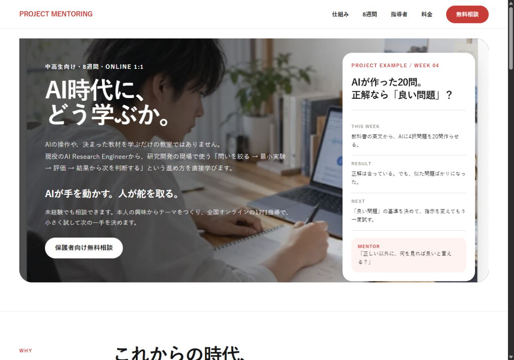
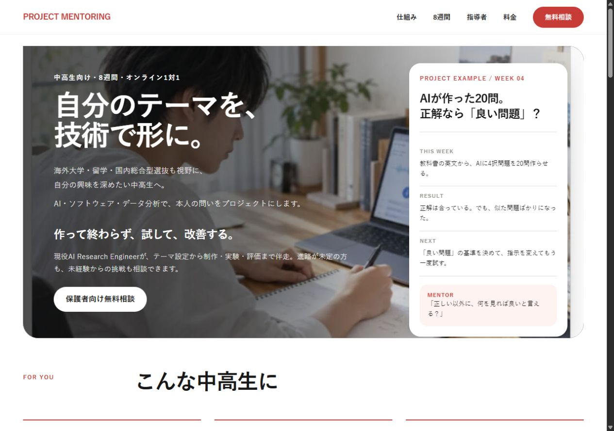
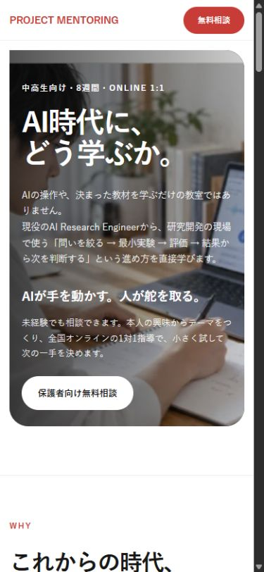
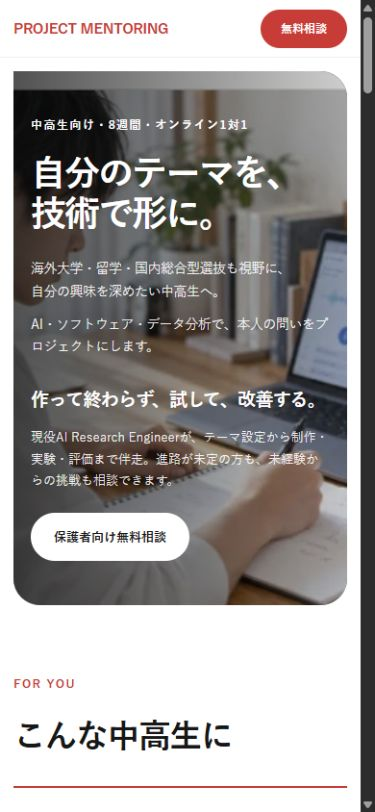
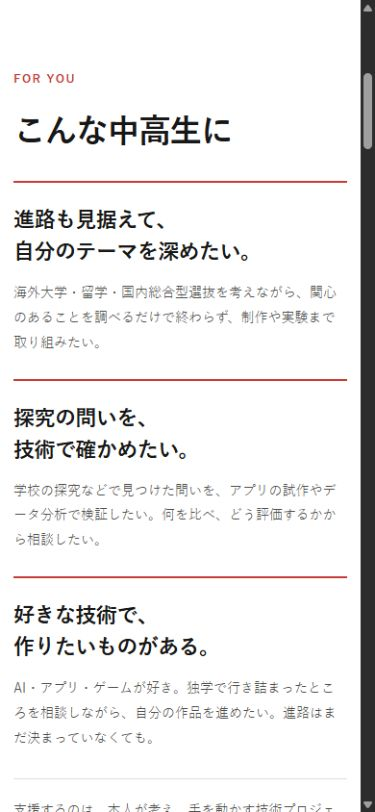
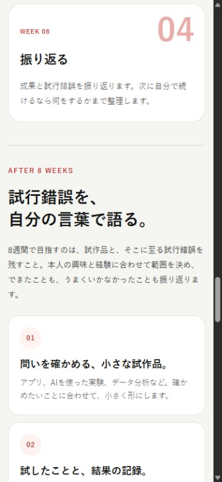
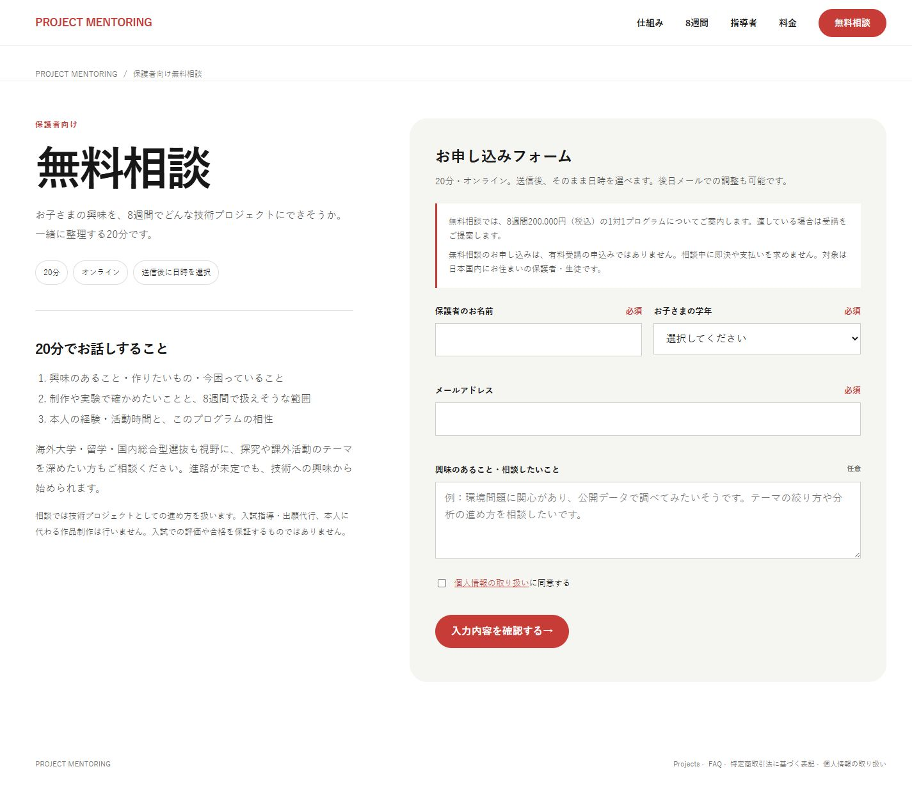
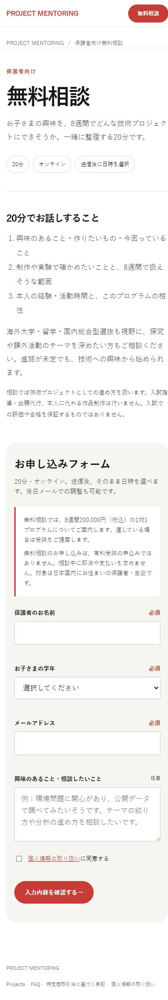

# LP訴求微修正レビュー — 2026-09-25

最新状態：Hero補足を「海外大学や総合型選抜も視野に、自分の興味を深めたい中高生へ。」に短縮し、Cloudflareのremote branch previewを作成・検証済み。本番は未反映。最新URL・検証記録・スクリーンショットは [REMOTE_REVIEW_20260925.md](REMOTE_REVIEW_20260925.md) を参照。以下は初回ローカルレビューの記録（Hero比較案を含む）。

## レビュー対象

- [安全なローカルHomeプレビュー](http://127.0.0.1:4195/project-mentoring-review/site-preview/)
- [相談ページ](http://127.0.0.1:4195/project-mentoring-review/site-preview/consultation.html)
- branch：両repoとも `review/lp-positioning-20260925`（ローカル）。
- 本番ソース：`site-production`、基点 `97e6626`。`public/`のみが本番payload。
- 外部review repo：`site-review`、基点 `c3d9431`。本番ソースとしては扱っていない。
- ローカルpreviewは `python review-preview-server.py`（親workspace）で再起動可能。解析・実フォーム送信なし、noindex/nofollow。既存レビュー用の送信後画面シミュレーションを保持。予約リンクのクリック・実予約は行っていない。

## 現行LPのレビューと方針

本番Home/consultationをブラウザで読み、表示とソース・review repoを比較した。本番HTMLの直接HTTP取得は403のため、全ファイルのbyte一致を検証したとは扱わない。

現行の写真、実験例、4段階の学習ループは支援内容を具体的に伝えている。一方、Hero「AI時代に、どう学ぶか。」とAfter 8 Weeksの自立能力中心の説明は、誰が今使うサービスかを読み手に委ねていた。進路・探究・制作という利用場面を前半へ置き、8週間の取り組みを具体化する。

NotionのGateway、Agent ToDo Ops、対象ToDo、実装仕様、獲得研究、Eコンシェルジュ・Globaledu・校外プログラム大全の最新記録を確認。紹介者・媒体の評価は購入意向や入試効果の実証ではない。受講実績・成約・需要をLP上に追加していない。

## Before / After

| 箇所 | Before | After | 理由 |
|---|---|---|---|
| Hero H1 | AI時代に、どう学ぶか。 | 自分のテーマを、技術で形に。 | 本人の目的と提供価値を即座に示す |
| Hero補足 | 一般的なAI教育との差別化と研究開発の工程 | 「海外大学・留学・国内総合型選抜も視野に、自分の興味を深めたい中高生へ。」＋AI・ソフトウェア・データ分析、制作・実験・評価の伴走 | 主な入口を具体化し、提供する技術支援につなぐ |
| 対象 | 独立した対象説明なし | Hero直下に「進路も見据える」「探究を技術で確かめる」「好きな技術で作る」の3場面 | 進路志向を先頭にし、技術好き・進路未定の生徒にも開く |
| After 8 Weeks | 自分で学べる・形にできる・次の挑戦を始められる | 「試行錯誤を、自分の言葉で語る。」＋試作品、結果の記録、自分の説明と次の一手 | 抽象的な能力の獲得断言を減らし、取り組む内容を具体化 |
| 無料相談 | 興味・テーマ・適合を聞く | 今の関心や困り事、8週間で扱える範囲、経験・活動時間との相性を整理 | 相談の目的と分かることを明確化 |
| metadata | 広いAI・プログラミング教育の説明 | Home/相談のdescription・OG/Twitter説明に対象とプロジェクト支援を反映 | ページ本文と共有時の説明を揃える |

料金200,000円（税込）、8週間、60分×8回、オンライン1対1、テキスト支援、保護者共有は維持。写真・色・既存ナビ・WHY/HOW・料金・指導者・FAQ/Projects本文は維持。Heroに進路未定・未経験の相談も明記。

## Heroの最終実装コピー

**自分のテーマを、
技術で形に。**

海外大学・留学・国内総合型選抜も視野に、
自分の興味を深めたい中高生へ。
AI・ソフトウェア・データ分析で、本人の問いをプロジェクトにします。

**作って終わらず、試して、改善する。**

現役AI Research Engineerが、テーマ設定から制作・実験・評価まで伴走。進路が未定の方も、未経験からの挑戦も相談できます。

CTA：保護者向け無料相談。

## 比較用Hero案（未実装）

### 案B：問いと検証を前面に

**気になる問いを、
試せるプロジェクトに。**

海外大学・留学・国内総合型選抜も考えながら、関心のあるテーマを深めたい中高生へ。AI・ソフトウェア・データ分析を使って、小さく作り、確かめ、改善する8週間。
現役AI Research Engineerがオンライン1対1で伴走します。進路が未定の方も相談できます。

違い：探究・実験の価値が強い。自由なアプリ制作の入口は採用案より少し狭く見える。

### 案C：本人が語れる過程を前面に

**作ったものに、
自分の考えを。**

海外大学・留学・国内総合型選抜も視野に、自分のテーマに取り組みたい中高生へ。何を作るか、どう確かめるか、次に何を変えるか。AI・ソフトウェア・データ分析のプロジェクトを、現役AI Research Engineerと進めます。
8週間・オンライン1対1。進路を問わず、技術への興味から始められます。

違い：完成品だけでなく判断・説明を重視できるが、具体的に何をするサービスかは採用案の方が速く伝わる。

3案とも入試効果を約束しない。効果比較の実測は未実施。

## コピー再点検

- 海外進学専門・受験塾・出願代行へ商品変更していない。支援対象は本人の技術プロジェクト。
- 対象セクション・相談ページで、入試指導、出願代行、本人に代わる作品制作を対象外と明記。
- After 8 Weeksは「目指す」と記載。到達点の個人差と入試評価・合格の非保証を明記。
- 勤務先社名、架空の成果・推薦・希少性、合格に有利という主張は追加なし。
- 進路語は入口と対象説明に配置。WHY/HOWや各成果カードには繰り返さず、技術支援の内容を説明。
- 既存のOG画像は変更していない（旧理念のコピー入り）。今回の共有説明文は本文に合わせて更新。画像刷新は今回の微修正の範囲外。

## 実装と検証

本番向け変更はHome、consultation、共通CSSに限定。`script.js`、`analytics.js`、`config.js`、consent処理は変更なし。既存SEO検査の旧Hero標語固定条件を、WHYに残る同趣旨の文言の確認へ更新した。

プレビュー生成では既存のsrcsetパスと改行依存の送信抑止コード挿入を修正し、挿入できなければ停止する確認を追加。review repoは既存の解析無効化・送信後シミュレーションを維持した。旧review repoの一部HTMLはindex,followだったため全ページをnoindex,nofollowへ揃えた。productionのrobotsは変更なし。

| 検証 | 結果 |
|---|---|
| JS構文、HTML構造・ID・ローカル参照、SEO/canonical/JSON-LD/料金/redirect | PASS |
| 同意/attribution/lead/booking合成DOM | 30項目PASS |
| 既存browser-regression：1440/900/320px × 4ページ | 12ケースPASS、横はみ出しなし |
| フォーム検証、確認→戻る10回、失敗、成功、二重クリック、timeout、honeypot | PASS（mock通信） |
| desktop/mobile目視 | Hero、対象、After 8 Weeks、相談を確認 |
| 320px Hero内のCTA | 最初に固定高さによる欠けを発見。高さを内容に追従させ再確認PASS |
| レビュー版入力→確認→完了画面 | PASS、実送信なしの表示を確認 |
| 公開・実送信・実予約 | 未実施 |

ローカルpreviewと画像が確認対象。本番公開前には、このブランチの差分をユーザーがレビューする。今回のコピーによる相談増加や成約効果は未検証。

## 画面

### Hero — desktop

Before

After

### Hero — mobile

Before

After

### 対象・8週間後・相談

