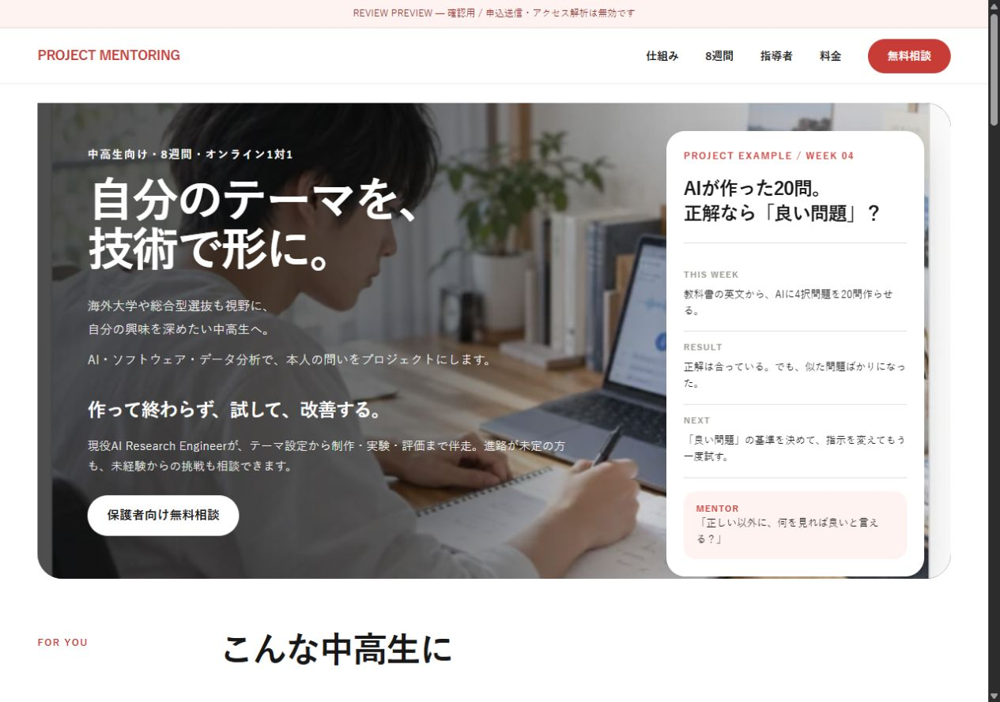
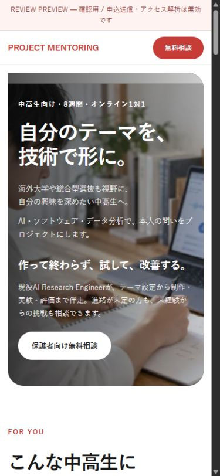
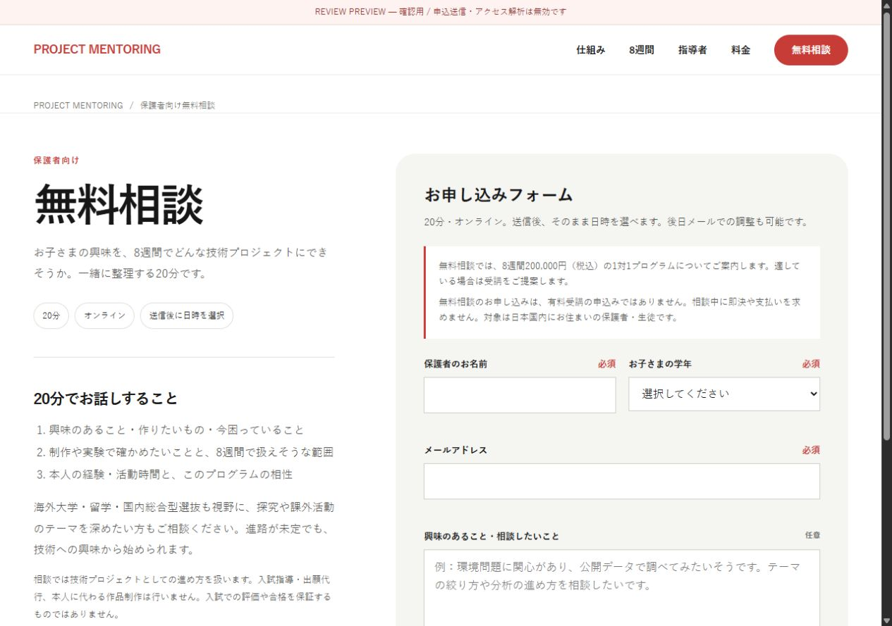
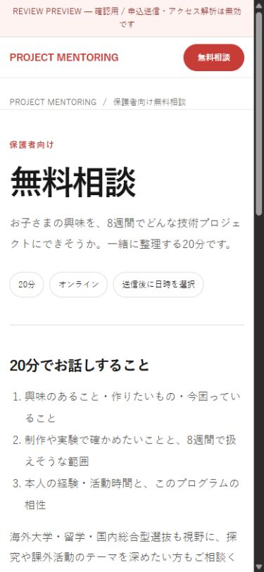

# Remote LP review — 2026-09-25

## 追加レビュー後の小修正（最新）

- [更新するHome preview URL](https://review-lp-positioning-202609.project-mentoring.pages.dev/)
- [更新するConsultation preview URL](https://review-lp-positioning-202609.project-mentoring.pages.dev/consultation)
- 今回の固定deployment URL： https://e6e57885.project-mentoring.pages.dev/
- コピー変更・配置payload commit：`30171ee828cfc0231eb92458cb0f76aaf559bf38`。本番sourceのローカルreview commit：`7427eb3`。
- Hero supportを「現役AI Research Engineerが、テーマ設定から制作・実験・評価まで伴走。進路やテーマがまだ固まっていなくても、本人の興味から相談できます。」へ変更。
- Home・consultationのmeta/OG/Twitter description、FOR YOU進路カード、consultation本文の列挙を「海外大学や総合型選抜」へ統一。4 HTMLファイルの差分が指定の文字列置換だけであることを確認。デザイン・構造・商品条件・境界は変更なし。
- 同じbranch alias URLでHome/consultationの1280px・390px・320pxを再確認。横スクロール・Hero CTA欠けなし。remote DOMで新コピー・descriptionと旧列挙の不在を確認。console warn/errorなし。
- [最新HTTP検査](review-artifacts/20260925-copy-followup/http-checks.json)・[ブラウザー検査](review-artifacts/20260925-copy-followup/browser-checks.json)はPASS。画像は同じディレクトリにHome/consultation × desktop/mobile/320pxの6枚を保存。sourceのJS構文・SEO・production-audit・同意/attribution等30項目もPASS。
- noindex/nofollow、フォーム送信・解析無効の仕組みは変更なし。production deployment `6ee5f50c-2068-4f26-9d7f-85f86ce632b1`、main、domains、設定hashは前回確認値と一致。production merge/deployなし。
- Notionの既存ToDoへ記録し、ユーザーの最終確認待ち。以下は前回previewの履歴。旧固定deployment URLは更新されないため、今回以降は上記branch aliasを使用する。

## 前回previewの記録

状態：remote previewの実画面検証完了。ユーザー／ChatGPTレビュー待ち。本番反映は未承認・未実施。

- [Home（今回のdeployment固定URL）](https://3e171ee3.project-mentoring.pages.dev/)
- [Consultation（今回のdeployment固定URL）](https://3e171ee3.project-mentoring.pages.dev/consultation)
- [Cloudflare branch alias](https://review-lp-positioning-202609.project-mentoring.pages.dev/)
- Git branch：`review/lp-positioning-20260925`。配置payload commit：`e002acf6c2c90380fd6b5c67787202bac3ac54dc`。
- 本番source側のHero修正commit：`a6c3a16`（review branchのみ）。

## 今回のコピー差分

Hero補足のみ「海外大学・留学・国内総合型選抜も視野に、自分の興味を深めたい中高生へ。」から **「海外大学や総合型選抜も視野に、自分の興味を深めたい中高生へ。」** へ変更。読点での改行は維持。

列挙による進学塾らしさを弱め、技術プロジェクト指導という本体を維持した。それ以外のpositioning修正、料金200,000円（税込）、8週間・オンライン1対1、既存のデザインは維持。対象セクション・consultation・descriptionには、ユーザーの「それ以外は原則維持」に従い初回案の進路表現が残る。

## Previewの構成と隔離

既存Cloudflare Pages `project-mentoring` はDirect Uploadでproduction branchが `main`。既存認証を使い、公式の[branch preview](https://developers.cloudflare.com/pages/configuration/preview-deployments/)として、`remote-preview/` だけを `--branch=review-lp-positioning-20260925` で配置した。[Direct Uploadの仕様](https://developers.cloudflare.com/pages/get-started/direct-upload/)に従う。課金・新規サービス登録・DNS変更なし。

`build-remote-preview.py` はレビュー版の生成専用で、deployは行わない。production用のフォーム・解析・同意処理には手を入れていない。

- 全ページのmeta robotsとHTTP X-Robots-Tagが `noindex,nofollow`。常設のREVIEW PREVIEWラベル。
- reviewOnly=true、送信endpoint空、実送信より前に終了するレビュー用フォーム分岐。
- 予約リンクはreview内へのリンクに置換。外部予約には進まない。
- analytics.enabled=false、measurementId空。analytics.jsは通信しないstub。
- 配信CSPが `connect-src 'none'; form-action 'none'`、script/image等は同一originに限定。
- 公開payloadに認証ファイル・token・credentialは含めない。Wranglerキャッシュはgitignore対象。OG画像は既存の公開画像を同梱してリンク切れを解消。

## Remote URLそのものの検証

| 対象 | 結果 |
|---|---|
| Home / consultation、1280px・390px・320px | PASS、横スクロールなし。Homeは1440pxも確認 |
| Heroの文言・改行・CTA | PASS。320pxでもCTAがHero領域内に収まる |
| こんな中高生に / After 8 Weeks / consultation | PC・mobileの実画面で確認。初回positioningを維持 |
| Home CTA → consultation、Projects → FAQ → Home | ブラウザーで遷移を確認 |
| ページ・参照ファイル・内部アンカー | 同一originの21 URLをHTTP検査。リンク切れなし。未知のURLは404 |
| noindex,nofollow | 5 HTMLページのmeta＋実HTTPヘッダーで確認 |
| フォーム確認→申込シミュレーション | 320pxで実行。「実際の送信はしていません」と表示。予約リンクもreview内に留まる |
| 本番送信・本番解析の抑止 | remote配信JSが監査したpayloadとSHA-256一致。endpoint空・review分岐・解析stub・CSPで抑止。実フォームへのPOSTは行っていない |
| ブラウザーconsole | 検証時のwarn/errorなし |
| sourceの必須チェック | SEO、production-audit、同意/attribution等の合成DOM30項目PASS |

再実行：`python verify-remote-preview.py https://3e171ee3.project-mentoring.pages.dev`（GETのみ）。検査記録：[HTTP](review-artifacts/20260925/http-checks.json)、[ブラウザー](review-artifacts/20260925/browser-checks.json)。

本番不変をCloudflare APIの前後比較で確認：canonical deployment `6ee5f50c-2068-4f26-9d7f-85f86ce632b1`、production branch `main`、domains、deployment configのSHA-256が一致。GitHub production mainも `97e6626eca948a14c66d48fafb91264c34979692` のまま。新deploymentはAPI上もenvironment=`preview`、branch=`review-lp-positioning-20260925`。

画面表示上の既知の不具合はなし。ただし、このセッションのWeb取得ツールでは固定URL・branch aliasとも取得できなかった。Codexブラウザーでのremote実表示とHTTP GETは成功しているが、ChatGPT側のURL取得ツールで必ず読めるとは保証しない。取得できない場合は、このGitHub上のスクリーンショットを併用する。Cloudflare/DNSの設定変更は行っていない。

相談増加・成約効果は未検証。フォーム送信・日時予約・本番計測の稼働確認はこのreview環境の目的外で、意図的に無効。明示承認までproduction merge/deployは行わない。

## Remote screenshots

### Home desktop / mobile

### Consultation desktop / mobile

### 320px・各セクション・フォーム

- [Home 320px](review-artifacts/20260925/home-320.png)
- [Consultation 320px](review-artifacts/20260925/consultation-320.png)
- [対象 desktop](review-artifacts/20260925/home-desktop-audience.png) / [mobile](review-artifacts/20260925/home-mobile-audience.png)
- [After 8 Weeks desktop](review-artifacts/20260925/home-desktop-outcome.png) / [mobile](review-artifacts/20260925/home-mobile-outcome.png)
- [フォーム確認](review-artifacts/20260925/form-confirm-320.png) / [シミュレーション完了](review-artifacts/20260925/form-complete-320.png)
